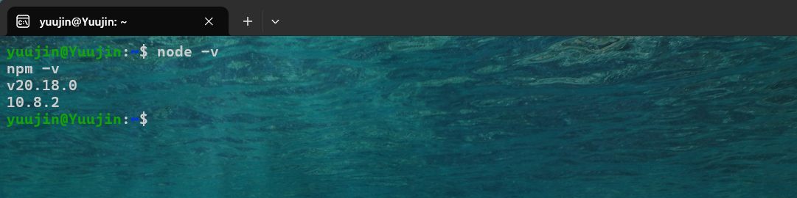
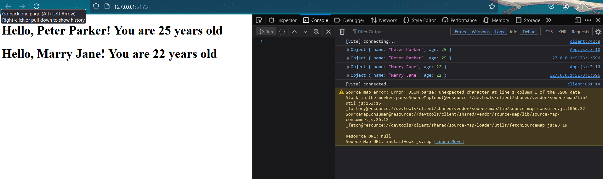
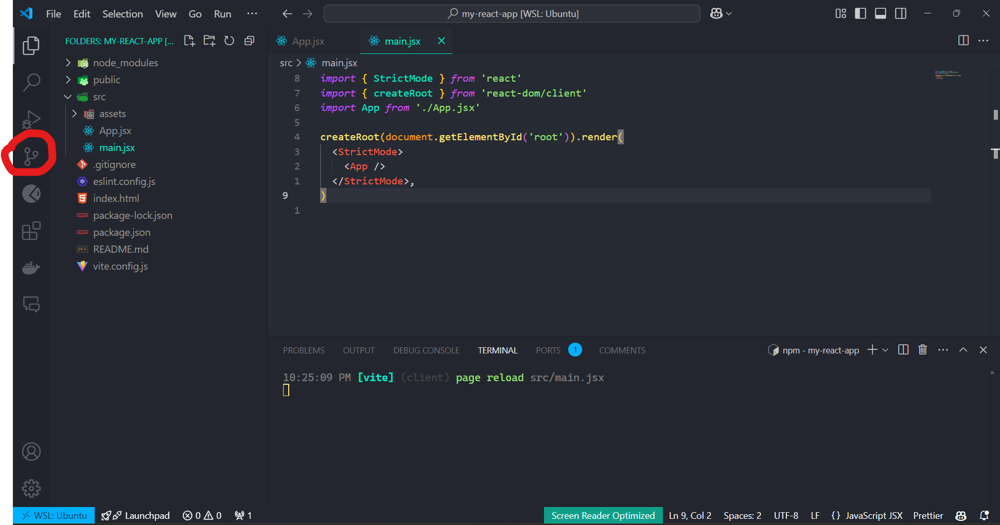
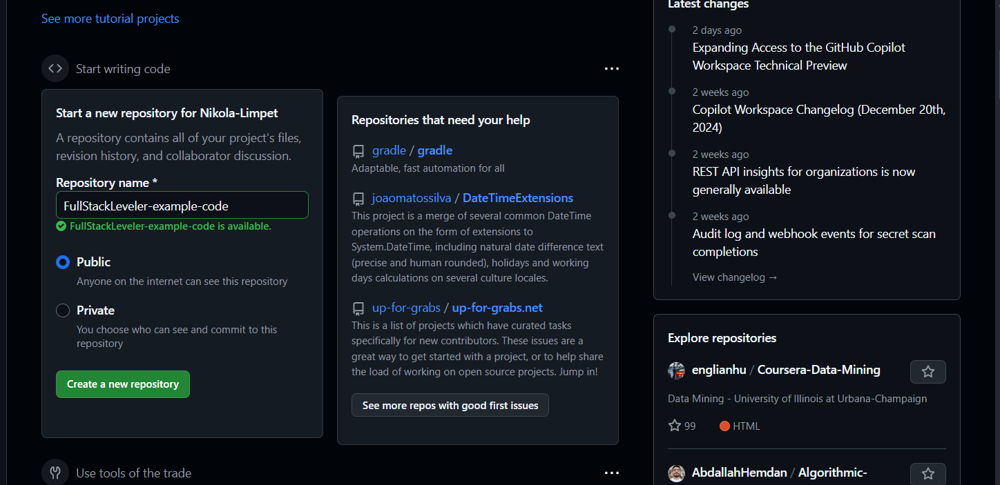
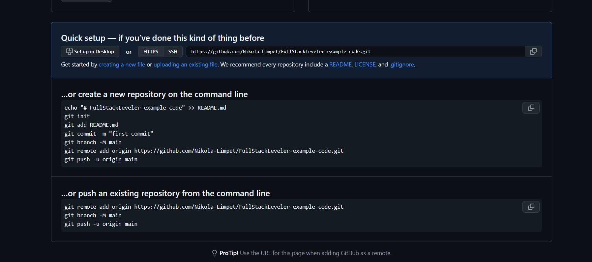
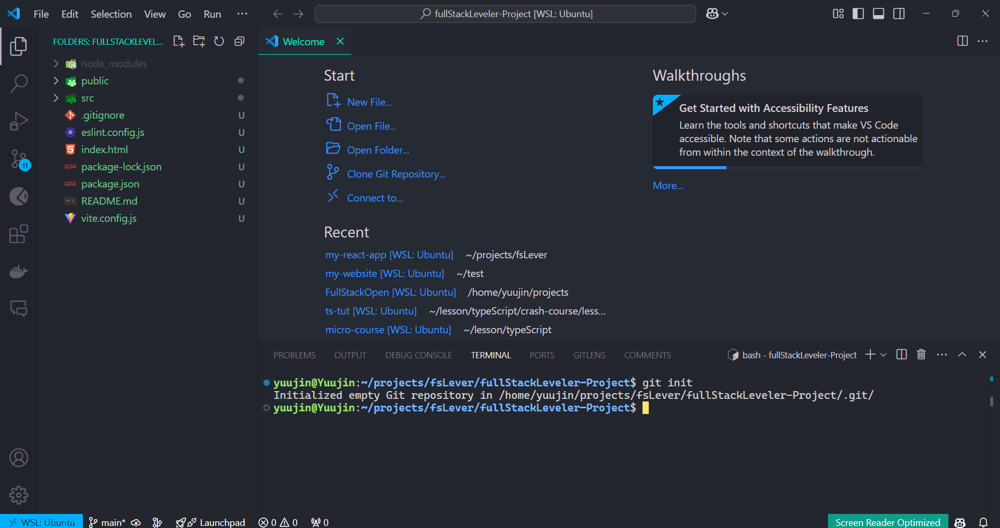
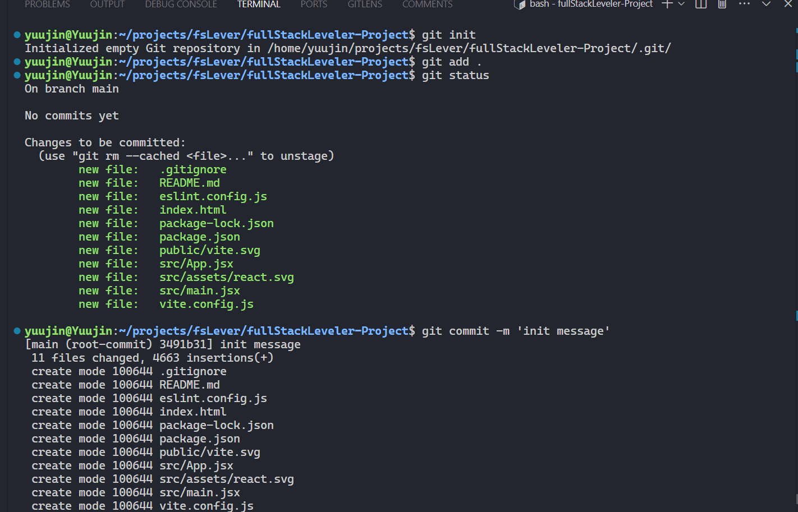
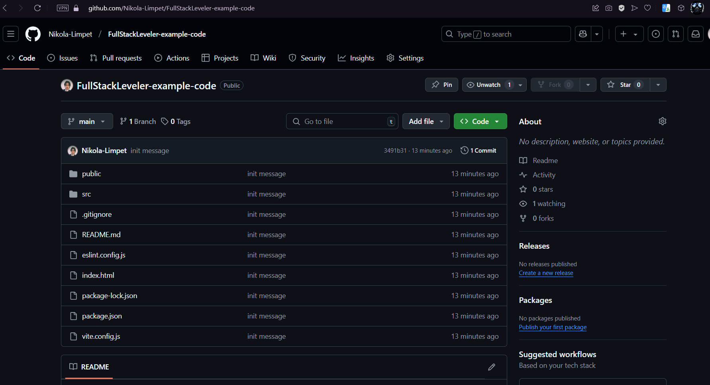
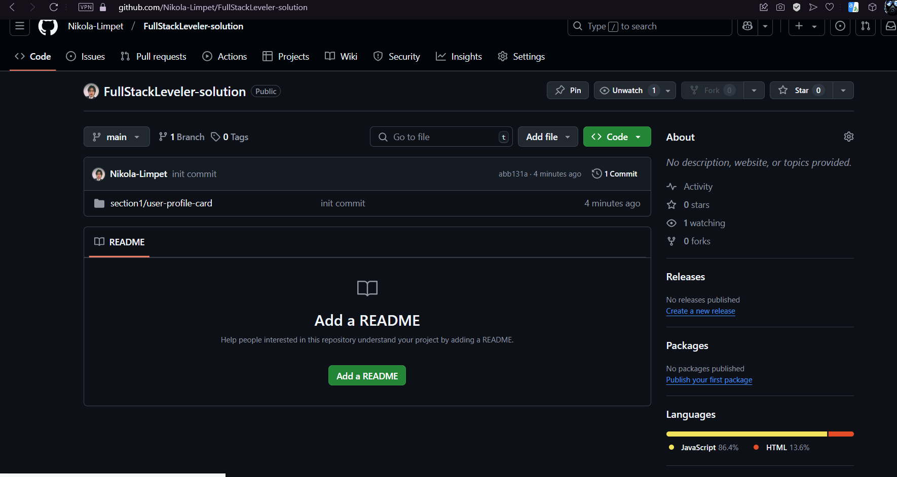

# React as Front-end Framework

## What is React?

**React** is a JavaScript library for building user interfaces.
It is maintained by Facebook and a community of individual developers and companies.
React can be used as a base in the development of single-page or mobile applications.
By now, it is one of the most popular JavaScript libraries for building user interfaces and is widely used for developing web applications.
It is good for you as a newly developer to learn React because it has a large community and a lot of resources to learn from. 
That is why we are going to learn React in this course.
For more information, visit the [official React documentation](https://reactjs.org/).


## Installation Node and NPM

Before installing Vite, you need to have Node.js and NPM installed on your machine.

Here is how you can install Node.js and NPM:

  Go to the [Node.js website](https://nodejs.org/en) and download the latest version or LTS(Long Term Support) of Node.js.

The ***NPM(Node Package Manager)*** will be install automathically with Node.js.

To verify that you have Node and NPM installed, run the following command in your terminal:
> **Tip:** If Node.js and NPM are already installed, you can quickly check their versions to ensure compatibility.

```bash
node -v
npm -v
```
Here is what the output should look like:




## Vite

Vite is a CLI(Command Line Interface) tool for web development. We will create our React project using Vite because it is fast and easy to use.
This will show you the version of NPM you have installed. 
For this course you must have at least version 18.0.0 or above.

To install Vite, run the following command:

```bash
npm create vite@latest fullStackLeveler-Project -- --template react
``` 
- create vite@latest is provided by npm to scaffold a new project using Vite.
- fullStackLeveler-Project is the project name.
- --template react tells Vite to use the React template.
```bash
cd fullStackLeveler-Project
npm install
```

To start the development server, run the following command:

```bash
npm run dev
```

In your terminal, you should see the following output:


:::info 
You may see a different version number than the one shown in the image above. This is because the Vite version is updated frequently.
Also, my terminal is using WSl2, so the output may look different from yours.
But don't worry, as long as you see the output, you are good to go. 
:::


Let's delete the file that aren't nessacary for now like index.css and App.css from your `src` folder.
and the `App.jsx` should look like this:
```jsx title="src/App.jsx"


function App() {
  return (
    <div>
      <h1> Hello, World! </h1>
    </div>
  )
}

export default App
```
Now, open your browser and go to [http://localhost:5173](http://localhost:5173) to see your React app running.


## React Components

Let's take a quick look at React components.

The file inside the `src` folder is the main file of your React app.

`main.jsx` is the main component of your React app. It is the parent component that holds all the other components.
By default, Vite will provide you with the import statement from the `App.jsx` file and `index.css` file. Let's delete the `index.css` file because we don't need it for now.
```jsx title="src/main.jsx"
import { StrictMode } from 'react'
import { createRoot } from 'react-dom/client'
import App from './App.jsx'

createRoot(document.getElementById('root')).render(
  <StrictMode>
    <App />
  </StrictMode>,
)


```
In the first line, it imports the `App` component from the `App.jsx` file.
then it uses the `ReactDOM.createRoot` method to render the `App` component to the `root` element in the `index.html` file.


```jsx title="src/App.jsx"
const App = () => {
  return React.createElement(
    "div",
    {},
    React.createElement("h1", {}, "Hello World!")
  );
};
```
```
ReactDOM.createRoot(document.getElementById('root')).render(<App />)
```

Here is vanilla JavaScript code that does the same thing: 
 - the App function component return React create element that will render it to the root element in the index.html file.
 - the first argument `div` is will render in index.html file.
 - the second argument is an attribute in this case is empty. e.g `class`, `id`, `style` etc.
 - the third argument is the `h1` element that will render in the `div` element and the contnet of the `h1` element is `Hello World!`.

Congratulations! You have successfully created your first React app using Vite.

## JSX Syntax

Most React developers use JSX syntax to write their components. JSX is a syntax extension for JavaScript that looks similar to HTML. It is not necessary to use JSX, but it makes the code more readable and easier to write.
As you know that HTML is not a programming language,
JSX allows you to use Logic of JavaScript inside the HTML by using `{}`.

for example, in the your `App.jsx`

```jsx title="src/App.jsx"

function App() {

  const name = "John Doe"
  return (
    <div>
      <h1> Hello, {name}! </h1>
    </div>
  )
}

export default App

```
Let's open your browser and go to [http://localhost:5173](http://localhost:5173) again 
You will see the output is `Hello, John Doe!` in the browser.

In practice, JSX is much like HTML with the distinction that with JSX you can easily embed dynamic content by writing appropriate JavaScript within curly braces.
The difference between JSX and HTML is that JSX can have dynamic content and HTML can't.
Also, JSX is converted to JavaScript by Babel before it is rendered to the browser.

JSX self-closing tags are similar to HTML, but it is necessary to close the tag in JSX:
```bash HTML
<hr>
```
```jsx
<hr />
```


In React, It's all about Components. Components are the building blocks of a React application. 
A React component is a reusable piece of code that defines how a part of the user interface should look and behave. 
Components can be nested inside other components to create complex user interfaces.

Let's modify the `App.jsx` file to use a component.

```jsx title="src/App.jsx"
import React from 'react';

function Greeting() {
  return <h1>Hello, World!</h1>;
}

function App() {
  return (
    <div>
      <Greeting />
    </div>
  );
}
export default App;
```


The Greeting function is called a functional component. It is a simple function that returns a React element.
This will render the `Greeting` component inside the `App` component.


:::info 
You have 3 options to create a React component:
- Function Component
- Class Component
- Arrow Function Component
The Arrow function component is the most popular way to create a React component.
it use in JavaScript ES6 syntax.

Arrow Function Component:
``` const Name = () => {}```


it is the same as the Function Component:
``` function Name() {}```

Class Component:
``` class Name extends React.Component {}```
:::

Since the definition of a component state that it's reusable code 
So let copy and past it 2 times
```jsx title="src/App.jsx"
function Greeting() {
  return <h1>Hello, World!</h1>;
}

function App() {
  return (
    <div>
      <Greeting /> {/* Hello World! */}
      <Greeting /> {/* Hello World! */}
    </div>
  );
}

export default App;

```
We know that we can use JSX modify that, So Let declear a variable `name` with your name and render it in the `Greeting` component.

```jsx title="src/App.jsx"
import React from 'react';
function Greeting() {
  const name = "John Doe";
  return <h1>Hello, {name}!</h1>;
}

function App() {
  return (
    <div>
      <Greeting /> {/* Hello John Doe! */}
      <Greeting /> {/* Hello John Doe! */}
    </div>
  );
}
export default App;

``` 
But in React, we don't want to repeat the same code. 
What if you want to display "Hello John Doe!" and "Hello Jane Doe!"? 
This may not work since we declared our name as John Doe. It will always return John Doe. 
To make it more dynamic, this is where props come in.

## Props

[Props](https://react.dev/learn/passing-props-to-a-component) are short for properties. 
They are a way to pass data from a parent component to a child component in React.
Props are read-only and cannot be modified by the child Component


Let's modify the `Greeting` component to accept a `name` prop.

```jsx title="src/App.jsx"
import React from 'react';
function Greeting(props) {
  return <h1>Hello, {props.name}!</h1>;
}

function App() {
  return (
    <div>
      <Greeting name="John Doe" /> {/* Hello John Doe! */} 
      <Greeting name="Jane Doe" /> {/* Hello Jane Doe! */}
    </div>
  );
}
```
:::tip Remember 
  **Props** is a way that you pass data from a parent component to a child component. 
  In this case, we pass the `name` prop from the parent `App` component to the `Greeting` children component.
  You can not modify the props in the child component. for example, you can't do `props.name = "Jane Doe"`.
:::

You may notice that the `Greeting` function has a `props` parameter as an argument. As an argument,
the `props` parameter is an object that contains all the properties passed to the component.

```props.name``` is used to access the `name` prop passed from its parent to the children component `Greeting`.

Not only can you pass strings as props, but you litlerly pass anything you want. 
For example, you can pass a number, an array, an object, a function, or even another component as a prop.

```jsx title="src/App.jsx"
import React from 'react';
function Greeting(props) {
  return (
    <div>
      <h1>
        Hello, {props.name}! You are {props.age} years old
      </h1>
    </div>
    );
}

function App() {
  const name = 'Peter Parker';
  const age = 25;
  return (
    <div>
      <Greeting name={name} age={age} /> {/* Hello Peter Parker! You are 25 years old */}
      <Greeting name="Marry Jane" age={age - 3} /> {/* Hello Marry Jane! You are 22 years old*/}
    </div>
  );
}
export default App;
```

:::note console.log
Remember you will find yourself use a lot of console.log throughout your development to see what props values you are passing.
  For best practice, if you are not what props values you are passing, you must use `console.log` to see the values.
If in your console you see the error you must not write more code until you fix the error.
:::

Here is the best practice to see the props values you are passing:

```jsx title="src/App.jsx"
import React from 'react';
function Greeting(props) {
  console.log(props);
  return (
    <div>
      <h1>
        Hello, {props.name}! You are {props.age} years old
      </h1>
    </div>
    );
}

function App() {
  const name = 'Peter Parker';
  const age = 25;
  return (
    <div>
      <Greeting name={name} age={age} /> {/* Hello Peter Parker! You are 25 years old */}
      <Greeting name="Marry Jane" age={age - 3} /> {/* Hello Marry Jane! You are 22 years old*/}
    </div>
  );
}
export default App;
```
Now, open your browser and go to [http://localhost:5173](http://localhost:5173) again to see the props values in the console. 
If you are using window, press `Ctrl + Shift + I` to open the console in your browser. or right-click on the page and click on `Inspect` to open the console.
For Mac users, press `Cmd + Option + I` to open the console.




- At the right side of the console, you will see the props values you are passing to the `Greeting` component.
- The browser tells that it returned two objects with the name and age properties.
- The first object is `{name: "Peter Parker", age: 25}` and the second object is `{name: "Marry Jane", age: 22}`.

:::info 
Since it is an object, as you know, you can access the object properties by using the dot notation.
by using `props.name` and `props.age` to access the object properties. 
Let's think props as an object that contains all the properties passed to the component.
and you can access the object properties by using the dot notation.
:::

Let write one more component called footer and pass it to the `App` component.

```jsx
const footer = () => {
  return (
    <div>
      <p> React Course written by Yuujin</p>
    </div>
  )
}
```
If you are using the `footer` component in the `App` component, the page is not going to display the content defined within the footer component, and instead React only creates an empty footer element,
i.e. the built-in HTML element instead of the custom React element of the same name.
If you change the first letter of the component name to a capital letter, then React creates a div-element defined in the Footer component, which is rendered on the page.

After written a few line of code, you may notice that why Greeting is start with a capital letter.
Becasue in React, components names must start with a capital letter. If you don't start with a capital letter, React will treat it as a regular HTML element.
it might be confusing to you and other developers who are working with you or in some cases, it might not work as expected.


Let's rewrite the `Footer` component with a capital letter.

```jsx title="src/App.jsx"
const Footer = () => {
  return (
    <div>
      <p> React Course written by Yuujin</p>
    </div>
  )
}
```
Now, let's use the `Footer` component in the `App` component.

```jsx title="src/App.jsx"
import React from 'react';
function Greeting(props) {
  return (
    <div>
      <h1>
        Hello, {props.name}! You are {props.age} years old
      </h1>
    </div>
    );
}

const Footer = () => {
  return (
    <div>
      <p> React Course written by Yuujin</p>
    </div>
  )
}

function App() {
  const name = 'Peter Parker';
  const age = 25;
  return (
    <div>
      <Greeting name={name} age={age} /> {/* Hello Peter Parker! You are 25 years old */}
      <Greeting name="Marry Jane" age={age - 3} /> {/* Hello Marry Jane! You are 22 years old*/}
      <Footer />
    </div>
  );
}

```
One more important thing to remember is that you can only return one element in a component.
If you want to return multiple elements, you must wrap them in a parent element.
In this case, we wrap the `Greeting` and `Footer` components in a `div` element.

The content of a React component (usually) needs to contain one root element. If we, for example, try to define the component App without the outermost div-element:

```jsx title="src/App.jsx"
function App() {
  return (
    <Greeting name="John Doe" />
    <Footer />
  );
}
```
In case there is only one component, you can return it without wrapping it in a parent element.
But if you have multiple components, React will throw an error because it expects only one root element to be returned from the component.
To fix this, we need to wrap the `Greeting` and `Footer` components in a `div` element or just `<>` and end with `</>`.

```jsx title="src/App.jsx"
function App() {
  return (
    <>
      <Greeting name="John Doe" />
      <Footer />
    </>
  );
}
```

## Objects are not valid as a React child

Do not return an object in a React component.
If you return an object in a React component, you will get an error message that says "Objects are not valid as a React child".
This is because React expects a valid JSX element to be returned from the component.

```jsx title="src/App.jsx"
const App = () => {
  const friends = [
    { name: 'Peter', age: 4 },
    { name: 'Marry', age: 10 },
  ]

  return (
    <div>
      <p>{friends[0]}</p>
      <p>{friends[1]}</p>
    </div>
  )
}

export default App
``` 
This cause problem because we are trying to render an object in the JSX.

To fix this, you can render the object properties one by one instead of the object itself.

```jsx title="src/App.jsx"
const App = () => {
  const friends = [
    { name: 'Peter', age: 4 },
    { name: 'Marry', age: 10 },
  ]

  return (
    <div>
      <p>{friends[0].name} {friends[0].age} </p>
      <p>{friends[1].name} {friends[1].age} </p>
    </div>
  )
}

export default App
```

## Version Control with Git and GitHub

Version control is a system that records changes to a file or set of files over time so that you can recall specific versions later.
It allows you to revert files back to a previous state, revert the entire project back to a previous state, compare changes over time, see who last modified something that might be causing a problem, who introduced an issue and when, and more.
Version control is a must-have tool for every developer.
Here you can watch and learn to get some refresh knowledge about [Git tutorial by Programming with Mosh](https://www.youtube.com/watch?v=8JJ101D3knE&t=2993s).

### What is Git?
Git is a distributed version control system that allows you to track changes in your codebase.
It is a tool that helps you to keep track of your code changes and collaborate with other developers.
Git is widely used in the software development industry and is a must-have tool for every developer.

If you are using VS code you may notice 
the little icon on the left side of the VS code.



You will not see anything just yet because you are not config Git in your project.
Let's start by installing Git on your machine.

### Installing Git

To install Git on your machine, follow the instructions below:

1. Go to the [Git website](https://git-scm.com/) and download the latest version of Git.
2. Run the installer and follow the installation instructions.
3. Open your terminal and run the following command to check if Git is installed:

```bash
git --version
```
Now that you have Git installed on your machine, you can start using it to track changes in your codebase.

You must have a GitHub account to use Git. If you don't have one, go to the [GitHub website](https://github.com/) and create an account.

After sign up with your email and username, 
You now will need to config it globally in your local machine, so whenever you push code you dont have to log in every time.

```bash
git config --global user.name "Your Name"
git config --global user.email "Your Email"
```
This will set your name and email globally in your local machine.

### Creating a Git Repository

Now let's open Github and create a new repository.
Like this by enter the repository name and choose public on the create repository button. 


After you create a new repository, you will see the repository URL. Let's copy the URL in https://github.com/Nikola-Limpet/FullStackLeveler-example-code.git

:::info
You will see the URL is different from mine, but don't worry about it.
:::



In the first line, the command `echo "# FullStackLeveler-example" >> README.md` will create a README.md file in your project and add the text `# FullStackLeveler-example` to the file.
But we now let ignore this line.

In the second line, `git init`. 
This will initialize the folder or directory as a Git repository. Git will reconize by the `.git` at the end of the folder.

Now open your termnial in your IDE, if you are still running the press `Ctrl + C` to terminate the localhost in Vite.

Let's initialize our projects in your current project folder.
```
git init
```


Now your project is initialized as a Git repository by the `.git` at the end of the folder.
and the little icon on the left side of the VS code will show you the changes in your project.
and turn the color to green. Meaning that you have initialized your project as a Git repository.

:::info Git
### Understanding Git Stages

Git is a version control system that tracks changes to your files. There are four main stages in Git:

1. **Untracked**: 
   - The file is not tracked by Git. 
   - When you first initialize a Git repository, all files are in this state.
   - To start tracking a file, you need to add it to the staging area using the `git add` command.

2. **Unmodified**: 
   - The file is tracked by Git but has not been modified since the last commit.
   - This means the file is in sync with the repository and no changes have been made.

3. **Modified**: 
   - The file is tracked by Git and has been modified since the last commit.
   - Changes have been made to the file, but they have not yet been staged for commit.

4. **Staged**: 
   - The file is ready to be committed.
   - After modifying a file, you can stage it using the `git add` command.
   - Staging a file means you are preparing it to be included in the next commit.

### Example Workflow

1. **Initialize a Git repository**:
   ```bash
   git init
    ```
This command initializes a new Git repository in your project directory.


2. **Check the status of your files**:
    ```bash
    git status
    ```

This command shows the current state of your files. Initially, all files will be untracked.
3. **Add files to the staging area**:
    ```bash
    git add .
    ```
    ***NOTE***: The `.` means all current files in the directory. You can also add specific files using `git add <filename>`.

    or 

    ```bash
    git add <filename>
    ```
This command adds files to the staging area. You can add all files using `git add .` or add specific files using `git add <filename>`.

4. **Commit changes**:
    ```bash
    git commit -m "Initial commit"
    ```
This command commits the staged files to the repository with a message(Initial commit) describing the changes.

5. **Push changes to a remote repository**:
    ```bash
    git remote add origin <repository-url>
    git branch -M main
    git push -u origin main
    ```
This command adds a remote repository, sets the main branch as the default branch, 
and pushes the changes to the remote repository.

:::

### Adding Files to the Staging Area
After `git init` you will see the `Untracked files` in the terminal.
This means that the file is not tracked by Git.
To start tracking a file, you need to add it to the staging area using the `git add` command.

```bash
git add .
```
This command adds all files in the current directory to the staging area.

to check the status of your files, run the following command:

```bash
git status
```
it will show blue color in the terminal, meaning that the file is ready to be committed.

### Committing Changes
After adding the files to the staging area, you need to commit the changes to the repository.
This means you are saving the changes to the repository with a message describing the changes.

```bash
git commit -m "init message"
```
After committed the changes, you will see the message in the terminal.



### Pushing Changes to a Remote Repository
After committing the changes, you need to push the changes to a remote repository.
This means you are uploading the changes to the remote repository.

```bash
git branch -M main
git remote add origin <repository-url> 
git push -u origin main
```
This command adds a remote repository, sets the main branch as the default branch, and pushes the changes to the remote repository.
Mine is `git remote add origin https://github.com/Nikola-Limpet/FullStackLeveler-example-code.git` and yours is different from mine.

Now open your github account and refresh the page, you will see the changes in your repository.


:::tip Resources
I know it is a lot of information to take in, but don't worry, you can always refer to the following resources:
you do not have to remember all the commands in git. You just need to know the basic commands to get started.
Here is a useful resource to help you get started with Git:
- [Git Cheat Sheet](https://education.github.com/git-cheat-sheet-education.pdf)
- [Git Handbook](https://guides.github.com/introduction/git-handbook/)
:::


## Exercise 1.1
Let create new git repository call `FullStackProject` in your github account. and follow the steps above to initialize the git repository in your local machine and push it to the remote repository.

***Note***: You should create a new folder in your local machine call `FullStackProject`
and initialize the git repository in the folder.
Remember you will use that repository to do more exercise in the future.
Let name your repository to be more readable.
For example, in your folder name `FullStackProject` should contain a folder name `Section1` and `Section2` and so on.

In your terminal, type command `mkdir FullStackProject` to create a new folder.
- Then `cd FullStackProject` to go inside the folder.
- Init your git repo `git init`
- Then `mkdir section1` to create directory name section1 in the FullStackProject folder.
- Then `cd section1` to go inside the section1 folder.
- Then `npm create vite@latest user-profile-card -- --template react` to create a new React project in the section1 folder.
- Then `cd user-profile-card` to go inside the section1 folder.
- Then `npm install` to install the dependencies.
- Then `code .` to open the project in VS code. 
- Then `rm -rf src/index.css` to remove the index.css file.
- Then `rm -rf src/App.css` to remove the App.css file.
- Then `git add .` to add all the files to the staging area.
- Then `git commit -m "Initial commit"` to commit the changes.
- Then `git branch -M main` to set the main branch as the default branch.
- Then `git remote add origin <repository-url>` to add the remote repository.
- Then `git push -u origin main` to push the changes to the remote repository.


:::caution **Terminology**:
From I will tell you some Terminology that you will use in the future not only in this course but also in your development career.
- **Repository**: A repository is usually call `repo`
- **Folder or Directory**: can be used interchangeably.
- `cd`: Change Directory
- `ls`: List Directory
- `mkdir`: Make Directory
- `touch`: Create a file
- `rm`: Remove a file
- `rm -rf`: cam be used to remove a directory and a file
:::


The result should look like this:


## Exercise 1.2-1.3: User Profile Card, Step 1

As mentioned earlier, We use the `rm -rf` command to remove the `index.css` and `App.css`.
You can just use the right click to the file you want to delete. Then your IDE will show the delete option.

***NOTE***: Don't forget the delete import statement in the `main.jsx` and `App.jsx`.

Now, the first exercise is to create User Profile Card application. You will create a simple application that displays user profile cards that each card will show a user'name, avatar, and a short bio. 
The data for each user will be passed to the card component as props.


```jsx title="src/App.jsx"

const App = () => {

  const title = 'User Profile Cards';
  const name1 = 'Aidan';
  const avatar1 = 'https://api.dicebear.com/9.x/adventurer/svg?seed=Aidan';
  const bio1 = 'Software Developer';

  const name2 = 'Emery';
  const avatar2 = 'https://api.dicebear.com/9.x/adventurer/svg?seed=Emery';
  const bio2 = 'Graphic Designer';

  const name3 = 'George';
  const avatar3 = 'https://api.dicebear.com/9.x/adventurer/svg?seed=George';
  const bio3 = 'Product Manager';


  return (
    <div>
      <h1>{title}</h1>

      <div>
        <h2>{name1}</h2>
        
        <p>{bio1}</p>
      </div>

      <div>
        <h2>{name2}</h2>
        
        <p>{bio2}</p>
      </div>

      <div>
        <h2>{name3}</h2>
        
        <p>{bio3}</p>
      </div>
    </div>  
  );
};

export default App;
```

Unfortunately, the entire application is in the same component. Refactor the code so that it consists of three new components:
Title, User image, and Bio. All data still resides in the App component, which passes the necessary data to each component using props. Header takes care of rendering the name of the course, Content renders the parts and their number of exercises and Total renders the total number of exercises.
Define the new components in the file App.jsx.
The App component's body will approximately be as follows:

```jsx title="src/App.jsx"
const App = () => {

  // const title = 'User Profile Cards';
  // ...

  return (
    <div>
      <Title title={title} />

      <UserName name={name1} />
      <UserImage avatar={avatar1} alt={name1} />
      <Bio bio={bio1} />

      <UserName ... />
      <UserImage ...  />
      <Bio ... />

      <UserName ... />
      <UserImage ...  />
      <Bio ... />
    </div>
  );
};

export default App;

```
Before you look at the solution, take a moment to try solving the exercise on your own. 
Remember, the best way to learn is by doing. Give it your best shot, and don't worry if you make mistakes. Every mistake is an opportunity to learn and improve. Good luck!

Here is the solution for the exercise:

You should do your best before looking at the solution.

<details>
  <summary>Show Solution</summary>

```jsx
const Title = (props) => {
  return (
    <div>
      <h1>{props.title}</h1>
    </div>
  );
};

const UserName = (props) => {
  return (
    <div>
      <h2>{props.name}</h2>
    </div>
  );
};

const UserImage = (props) => {
  return (
    <div>
      
    </div>
  );
};

const Bio = (props) => {
  return (
    <div>
      <p>{props.bio}</p>
    </div>
  );
};

const App = () => {
  const title = 'User Profile Cards';
  const name1 = 'Aidan';
  const avatar1 = 'https://api.dicebear.com/9.x/adventurer/svg?seed=Aidan';
  const bio1 = 'Software Developer';

  const name2 = 'Emery';
  const avatar2 = 'https://api.dicebear.com/9.x/adventurer/svg?seed=Emery';
  const bio2 = 'Graphic Designer';

  const name3 = 'George';
  const avatar3 = 'https://api.dicebear.com/9.x/adventurer/svg?seed=George';
  const bio3 = 'Product Manager';

  return (
    <div>
      <Title title={title} />

      <UserName name={name1} />
      <UserImage avatar={avatar1} alt={name1} />
      <Bio bio={bio1} />

      <UserName name={name2} />
      <UserImage avatar={avatar2} alt={name2} />
      <Bio bio={bio2} />

      <UserName name={name3} />
      <UserImage avatar={avatar3} alt={name3} />
      <Bio bio={bio3} />
    </div>
  );
};

export default App;
```
</details>

## Exercise 1.4: User Profile Card, Step 2

Now that you have created the User Profile Card application, but the code is written in the `App` component and it is not reusable.
The next step is to refactor the code so that it consists of three components: `Title`, `User`, and `UserList` into One component call `UserCard`.

Let's practice refactoring the code so that it consists of three new components: `Title`, `User`, and `UserList` into One component call `UserCard`.

```jsx title="src/App.jsx"
const UserCard = (props) => {
  //...
}
const Title = (props) => {
  return (
    <div>
      {/* ... */}
    </div>
  );
};
const App = () => {
  const title = 'User Profile Cards';
  // const name1 = 'Aidan';
  //...

  return (
    <div>
      <Title title={title} />
      <UserCard  name={name1} avatar={avatar1} bio={bio1} />
      <UserCard name={name2} avatar={avatar2} bio={bio2} />
      <UserCard name={name3} avatar={avatar3} bio={bio3} />
    </div>
  );
};

export default App;

```

:::tip Refactoring 

Refactoring is the process of restructuring existing computer code without changing its external behavior.
You should always have your browser open and `console.log(props)` to see the object of props that you have been passing from.
By doing this, you can ensure that the data being passed to your components is correct and as expected. It also helps in debugging and understanding the flow of data within your application.
Keeping the console open allows you to catch errors early and make necessary adjustments on the fly, making the development process smoother and more efficient.
:::


This application is not done yet. You will continue to work on it in the next section because you might feel that the code is not clean and reusable enough by copy the same code three times.